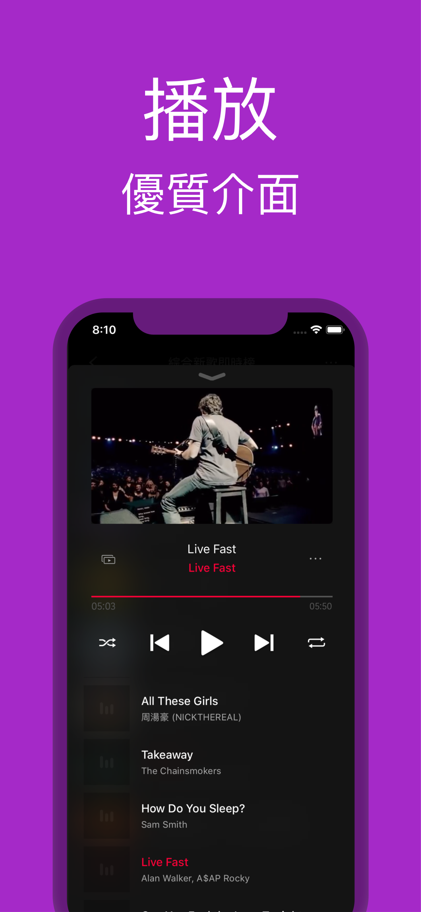

# App Store Preview
```
此 App 只能透過 iPhone 的 App Store 取得。
```
## iMuker 音樂影片MV播放器 
[XJIMI](https://github.com/xjimi/app_imuker/blob/main/README.md)    
曾經在「音樂」類中排名第 2  
免費    

   
  

## iPhone 截圖
 
 
 
  


## iPhone 截圖
 
 

## 介紹 截圖
 
 
 
 
 
 


## 簡介

超強音樂播放器 - iMuker  
• 完全免費  
• 擁有最新的熱門歌曲、排行榜、精選音樂  
• 不分語言、想聽的歌曲都找得到  
• 方便操作又優質的介面設計  
  
給你最即時又豐富的音樂體驗，滿足你對音樂生活的需求，現在就立即下載 iMuker 吧！  

• 多種最新熱門歌曲、排行榜、曲風歌單，滿足你各種音樂喜好。  

• 精選歌單每日更新，豐富你的音樂世界。  

• 建立自已的播放列表與音樂收藏，隨時聆聽最喜愛的歌曲。  

• 支援校正影片，可輕易校正歌曲與影片不符的音樂。  
  
• 強大搜尋引擊，整合 YouTube, iTunes, Apple Music, KKBOX 資訊，為你找尋最合適的音樂。  

• 時尚俐落又人性的介面，使你聽音樂不只方便。  


